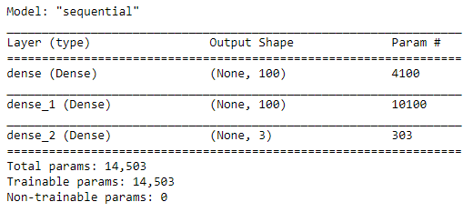
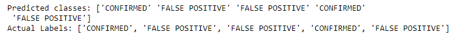
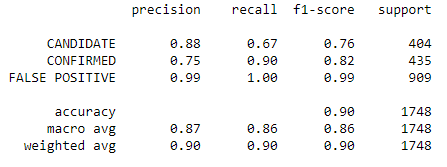

# machine-learning-challenge

## Background
The purpose of this project is to discover hidden planets using NASA keplar space telescope data and machine learning in Python. In [exoplanet_data.csv](exoplanet_data.csv), there are various columns of telescope data and more detailed description can be found in [the NASA Exoplanet Archieve Website](https://exoplanetarchive.ipac.caltech.edu/docs/API_kepcandidate_columns.html).

The project was done in **Python**, but there are multiple libraries like that **sklearn**, **tensorflow**, **pandas** and **joblib** were used.

## Analysis
Two models were used to compare the results of accuracy of the data.

### 1. Sequential Model
#### 1-1. First model - sequential model with two layers
The sequential model was built using **tensorflow library** and the accruacy was 0.890 with a loss of 0.265.

#### 1-2. Prediction and actual data
Using the sequential model, koi disposition was predicted as shown below.
The predicted data matched with the actual data.

### 2. Linear Model
#### 2-1. Second model - linear model
The linear model was built using **sklearn library** and the accracy of testing data was 0.856 and the training data was 0.837

#### 2-2. Hyperparameter tuning
The best parameter and accuracy was found using **GridSearch model** in sklearn library and the best parameter and the score were 0.0001 and 0.878

#### 2-3. Classification report
The classification report of the linear model is shown below:

